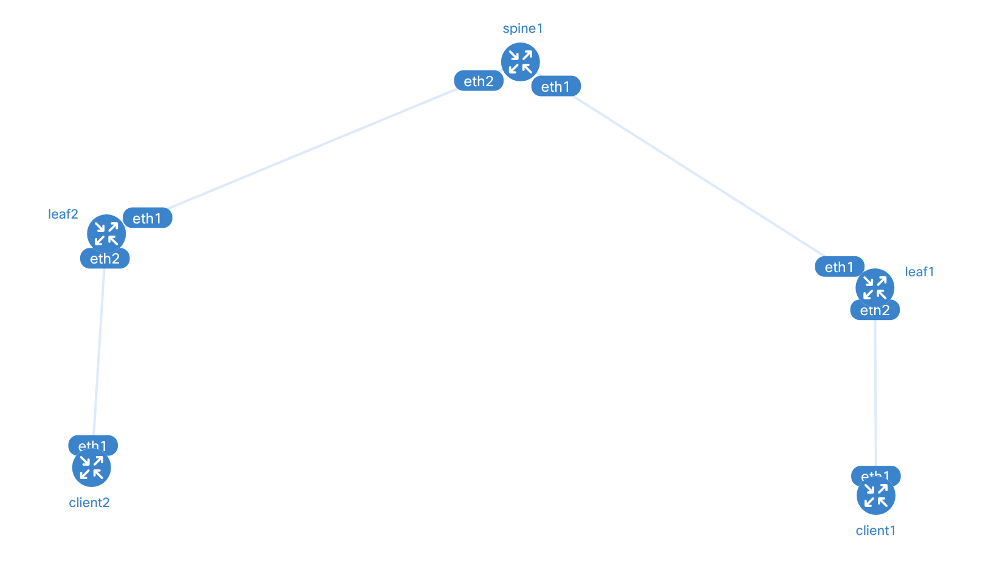

# Arista cEOS & NetBox Automation Lab

This project demonstrates a Source of Truth workflow for modern network engineering. It leverages NetBox as a centralized IPAM and Inventory database to dynamically configure an Arista cEOS leaf-spine topology.

## 🏗 Topology

The lab environment consists of a standard Leaf-Spine architecture:
* Spine1: Aggregation node handling inter-leaf traffic.
* Leaf1 & Leaf2: Access nodes providing gateway services to clients.
* Client1 & Client2: Alpine Linux nodes used for end-to-end data plane verification.

---

## 🛠 The Lab Stack (Architecture)

This lab is built on a "Full Stack" of virtualization and automation tools, optimized for macOS via OrbStack.

| Component | Role | Description |
| :--- | :--- | :--- |
| **OrbStack** | Virtualization Engine | A lightweight, high-performance replacement for Docker Desktop on macOS. |
| **Docker** | Container Runtime | Hosts the individual network nodes as isolated containers. |
| **Arista cEOS** | Network OS | Containerized EOS. Provides the full Arista CLI and eAPI (JSON-RPC) interface. |
| **Containerlab** | Orchestrator | Reads topology.clab.yml to deploy containers and create virtual "cabling." |
| **NetBox** | Source of Truth | The database holding the "intended state" of the network (IPs, Prefixes). |
| **Python Venv** | Isolation | Ensures pynetbox and pyeapi dependencies remain isolated. |

---

## 🚀 Workflow & Logic

The project follows the "Net-as-Code" philosophy where the network state is defined in a database before being pushed to production.

### Automation Steps:

1. **Intention**: We define IP addresses and interface assignments in the NetBox UI. This is our "Source of Truth."
2. **Extraction**: The sync_to_switch.py script uses the pynetbox library to pull the specific data for each device from the API.
3. **Execution**: The script translates that data into Arista CLI commands and pushes them to the switches via eAPI (JSON-RPC over HTTP) using pyeapi.

---

## 📖 Setup & Usage

### 1. Prerequisites
Ensure you have OrbStack/Docker running and Containerlab installed.

**Initialize the Python environment:**
- python3 -m venv venv
- source venv/bin/activate
- pip install pyeapi pynetbox

### 2. Deployment
**Deploy the topology using Containerlab:**
- sudo containerlab deploy -t topology.clab.yml

### 3. Synchronization
**Run the automation script to pull data from NetBox and configure the switches:**
- python3 sync_to_switch.py

---

## 🔍 Verification & Troubleshooting

### Connectivity Check
**Verify the IP status directly from the Arista CLI via Docker:**
- docker exec -it clab-m1-lab-spine1 Cli -c "show ip interface brief"

### Common Issues Resolved
* **eAPI Authentication**: Configured management api http-commands to allow Python access.
* **Git Large Files**: Used .gitignore to prevent tracking heavy .tar images or venv folders.
* **NetBox Duplicates**: Implemented .filter() in Python to handle multiple IP assignments on a single interface.